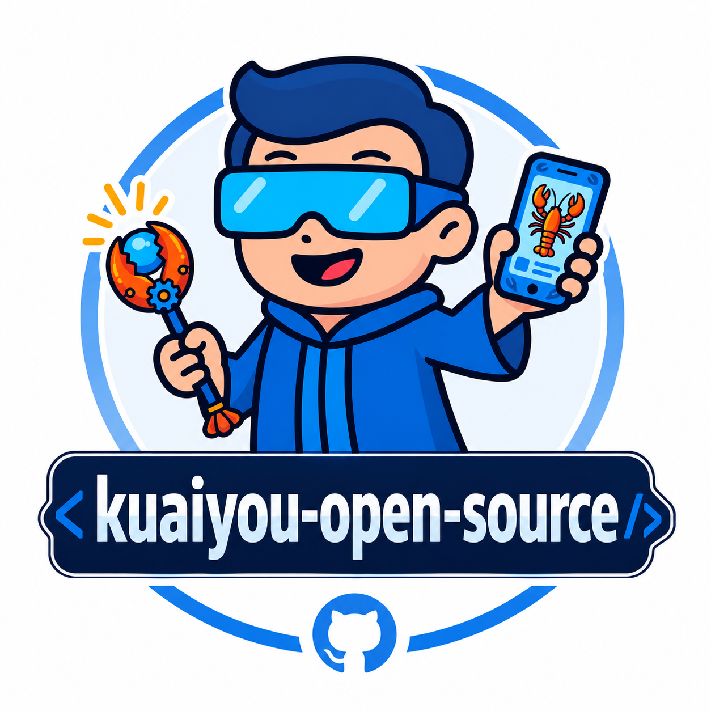

# Kuaiyou Open Source (快游大师开源生态)

<div align="center">
  
  <h2>The Agentic Skills</h2>
  <p>用 AI 编写 Android 端侧自动化技能（MCP + 快游大师）</p>
  <br />
  <a href="https://github.com/kuaiyou-app/kuaiyou-open-source">
    
  </a>
  <a href="https://www.npmjs.com/package/autoace-cli">
    
  </a>
  <a href="https://github.com/kuaiyou-app/kuaiyou-open-source/blob/main/LICENSE">
    
  </a>
  <a href="https://kuaiyou-app.github.io/">
    
  </a>
</div>

---

欢迎来到 **快游大师 (Kuaiyou Master)** 官方开源生态仓库！

**本项目的核心定位是打造 "The Agentic Skills"（智能体技能生态）。**
作为快游大师的开源中心，本仓库提供核心电脑端 CLI 工具（**autoace-cli**）、客户端实时技能契约的访问能力以及丰富的开发示例。
配合手机端「快游大师」App，您可以直接在 Cursor、Windsurf、Claude Code 等 AI 客户端中，使用自然语言快速生成 Android 端侧自动化**技能**，完成实时校验并一键下发至手机端本地执行，开启 AI 原生自动化的全新体验。

> **说明**：
> Android 客户端（无障碍执行引擎等）为闭源，请在应用商店搜索 **「快游大师」** 下载。
> **开源官网**：https://kuaiyou-app.github.io/ （源码：[`kuaiyou-app/kuaiyou-website`](https://github.com/kuaiyou-app/kuaiyou-website)）

---

## 核心能力

- **弹窗拦截**：高优先级识别并关闭青少年模式、更新提示、广告等打断主流程的弹窗。
- **语义点击**：通过 `semantic`（如「去签到」）结合无障碍树定位，减少绝对坐标依赖。
- **百分比坐标与相对滑动**：适配不同分辨率；可在指定面板内相对滑动。
- **本地执行**：动作在设备本地闭环（`tap` / `swipe` / `launchApp` / `delay` 等）；读写请用 `storeValue`，勿用已移除的 `readText` / `setClipboard`。
- **MCP 联调**：`autoace-cli` 供 AI 看屏、从客户端读取实时契约、校验并下发技能。

---

## 仓库导航

| 目录/模块 | 描述 |
| --- | --- |
| **[autoace-cli](./autoace-cli/)** | 电脑端 MCP CLI（npm 包名 `autoace-cli`）。 |
| **[docs](./docs/)** | 编写与联调手册；完整接入见 [mcp-ecosystem-tutorial.md](./docs/mcp-ecosystem-tutorial.md)。 |
| **[examples](./examples/)** | 技能示例 JSON。 |
| **[skills](./skills/)** | 社区技能 JSON（装进 App，不是 Agent Skill）。 |
| **[agent-skills/autoace](./agent-skills/autoace/)** | Agent Skill **`autoace`**（Claude Code `/autoace`、Codex `$autoace`）。 |
| **[开源官网 (Website)](https://kuaiyou-app.github.io/)** | 独立开源官网（源码位于 [`kuaiyou-website`](https://github.com/kuaiyou-app/kuaiyou-website)）。 |

---

## 快速开始

### 1. 准备手机端
- 安装最新版 **「快游大师」**。
- 打开 **设置 → 高级设置 → MCP 服务**，开启开关。
- 副标题显示地址与遮罩配对码；需要人工查看时点眼睛图标。**点击该条目**可复制给 Agent 的完整 stdio MCP 配置。
- *(当前仅支持局域网 HTTP 通道，手机与电脑需在同一网络。)*

### 2. 配置 autoace-cli
需 **Node.js ≥ 20、npm ≥ 10**。npm 包名：**`autoace-cli`**。

把 App 复制的信息粘贴给 Agent；它会按当前客户端格式注册以下用户级或本地 MCP 服务：

```text
serverName: autoace
transport: stdio
command: npx
args: ["-y", "autoace-cli"]
env:
  KUAIYOU_DEVICE_IP: "192.168.1.100:41899"
  KUAIYOU_MCP_PAIRING_CODE: "482917"
```

不要只在普通终端前台运行 stdio server，也不要把配对码提交到 Git。端口与配对码每次开启服务都会变化，请始终使用 App 当前复制的值。

也可全局安装：`npm install -g autoace-cli`。

推荐同时安装 Agent Skill **`autoace`**（见 [教程](./docs/mcp-ecosystem-tutorial.md)），在 Claude Code 用 `/autoace`，在 Codex 用 `$autoace`。

连接成功后，Agent 先调用 `get_kuaiyou_schema` 读取当前 App 的权威技能契约。`validate_kuaiyou_skill` 和 `push_reactive_skill` 执行时都会再次请求 `GET /api/mcp/schema`；仓库与 npm 包不提供本地 Schema 兜底。

> 配对码通过 `Authorization: Bearer` 发送（兼容旧变量名 `KUAIYOU_MCP_TOKEN`）。
> CLI 也支持优先级更高的 `KUAIYOU_DEVICE_URL=https://host:port`，供支持 TLS 的客户端使用。当前 HTTP 模式请仅在可信、隔离的局域网内使用。

### 3. 向 AI 下达指令
> 「请先读取当前客户端技能契约，再查看我现在的手机界面，写一个点击『去签到』的技能，并校验后推送到手机上运行。」

手机会弹出导入确认；确认后本地执行。

---

## 参与贡献

- Bug / 建议：[GitHub Issues](https://github.com/kuaiyou-app/kuaiyou-open-source/issues)
- 官网相关：[`kuaiyou-website`](https://github.com/kuaiyou-app/kuaiyou-website/issues)
- 贡献流程：[CONTRIBUTING.md](./CONTRIBUTING.md)

---

## 开源协议

Apache License 2.0。
